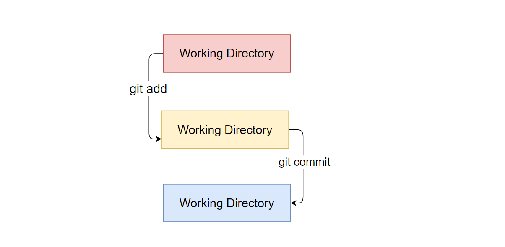

# Git学习

> 环境：Linux, Git
>
> Git 是电脑上的一个版本控制软件，而 Github 则是基于 Git 这个版本控制软件打造的一个网站（相当于一台 **中央服务器**）
>
> Git 的三个概念：提交 commit，仓库 repository， 分支 branch
>
> **某个应用场景**：发现代码崩掉了，然后通过 Git 发现是某一次提交（commit）的问题。然后我们可以回滚掉这次的提交，回到没有问题的版本。
>
> 
>
> ==问题==：不同的人，对一个文件同时进行修改的时候，怎么做到不混乱的？



### 1、init add commit

在根目录下创建一个 Tutorial 文件夹（本地的一个仓库）

```bash
mkdir Tutorial
cd Tutorial

$ git --version
git version 2.17.1

# （当前目录 Tutorial）修改一些东西，以 index.html 为例
$ vim index.html
# <html>NOTHING</html> // 把这行复制到 index.html
# 因为还没建立仓库，没有 initialize，用 git status 刻意查看状态
$ git status
fatal: not a git repository (or any of the parent directories): .git

# 然后是初始化一个仓库，仓库目录就是当前目录
mei@beichen Tutorial % git init
Initialized empty Git repository in /home/mei/Tutorial/.git/

# 初始化之后，就要设置配置信息  
mei@beichen Tutorial % git config --global user.name "Lu Beichen"  # 设置名字
mei@beichen Tutorial % git config --global user.email "lubeichen@outlook.com" 
mei@beichen Tutorial % git status   # 再次查看 git 状态
On branch master   # 这行表示 -- 这里是主分支

No commits yet     # 意思是：还没有提交记录

Untracked files:
  (use "git add <file>..." to include in what will be committed)

        index.html     # 这里是红色的部分，代表的还是在 working directory，表示可以随时修改，删除

nothing added to commit but untracked files present (use "git add" to track)

# working 到 staging 
$ git add index.html
$ git status
On branch master

No commits yet

Changes to be committed:
  (use "git rm --cached <file>..." to unstage)

        new file:   index.html    # 这里就发生了变化，显示的是绿色。

# add 之后，就是 commit
$ git commit -m "First initial commit"
[master (root-commit) 0771208] First initial commit
 1 file changed, 1 insertion(+)
 create mode 100644 index.html

mei@beichen Tutorial % git status                                                                           [0]
On branch master
nothing to commit, working tree clean
```


### 2、push

上面的流程，就是本地的流程，将本机的代码提交到本机的 repository 之后，就需要将本地 repository 同步到远程 repository 中。

1） 首先，需要有一个远程仓库。建立远程仓库的方法很简单，google it！

2）建立好远程仓库后，复制 远程仓库的链接地址 

​	https：https://github.com/beichen0100/Tutorial.git

​	ssh：setting -> SSH and GPG kyes -> new SSH keys


如果是 Linux 系统，那么在家目录下看是否有.ssh，如果没有，那么

```bash
$ ssh-keygen -t rsa -C "xxxxx.com"   # 后面添加自己的邮箱
$ cd .ssh/
$ cat id_rsa.pub   
# 将这个公钥复制下来，用到 github 的 new SSH keys 步骤之后填写（
# 这个就是将自己本地的公钥，放到自己的 GitHub 中，这样就可以通过 SSH 来提交到远程仓库了。
```

3）然后就是输入下面的命令

```bash
$ git remote add origin git@github.com:beichen0100/gitskills.git  # md垃圾云主机，这里竟然卡死了。

$ git remote -v   # 然后查看远程仓库地址是否正确
origin  https://github.com/beichen0100/Tutorial.git (fetch)
origin  https://github.com/beichen0100/Tutorial.git (push)
mei@beichen Tutorial %  

$ git branch  # 先看自己在哪个 branch 上
* master    # 现在在 master branch，所以任何操作都会直接推送到 master branch

$ git push -u origin  master   # 这两个是有区别的，不知道为什么有时候可以用 master，有时候就能用 main。
$ git push -u origin  main
```


### 3、clone，log

```
$ git clone git@github.com:beichen0100/gitskills.git
# 这就是将远程仓库（别人的自己的都可以）拉取到本地的 clone 操作

$ git log  # 查看 add 或者是 commit 了多少个版本，然后可以 reset 回退

$ git reset --hard HEAD^ # 向旧版本回退，回退到前一个版本。

$ git reset --hard 3f1abb564 # hard 后面接的是 commit id，使用 git log 可以得到。这里可以用来重返未来。
# 所以，一般回退的时候，建议使用 git log 获取 commit id，不然好像无法重返 ”未来“ 版本。
```


### github 上查找技巧

找百合大全 awesome xxx（关键词）

找例子 xxx sample

找空项目架子 xxx starter （例如，想开一个 spring java项目但是不想自己配置环境，可以直接找一个差不多可以直接跑的架子下来，改改就可以了）

找教程 xxx tutorial


语法

> in:name spring stars:>3000  # 搜索名字中有 spring 且 stars 数大于 3k 的项目

in:name xxxxx

in:readme xxxx 

in:description xxx  在介绍简洁中搜索关键词（这里用 中文 当作搜索关键词也很好）

language:java   限制语言搜索

stars:>3000 搜索stars数大于3k的

pushed:>2019-09-19   搜索最后更新事件要晚于2019-09-19的项目，越频繁更新的项目越好


# Windows平台的Git


